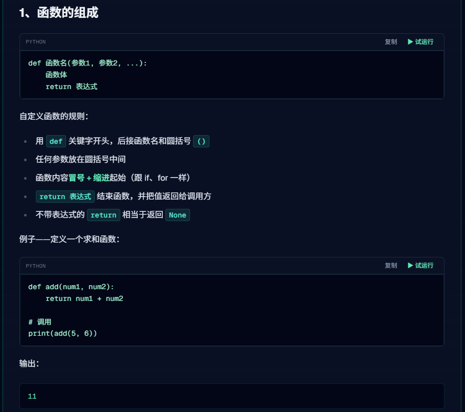
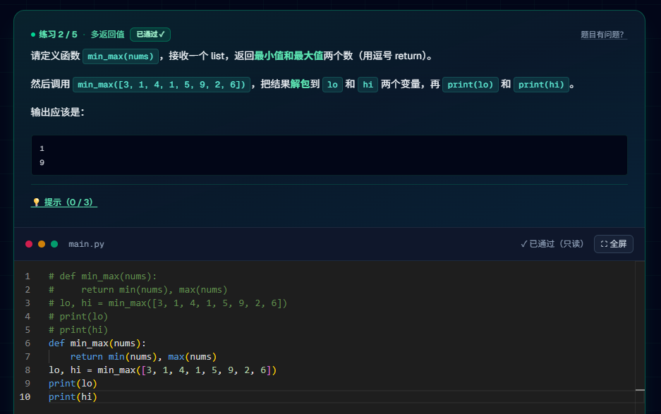
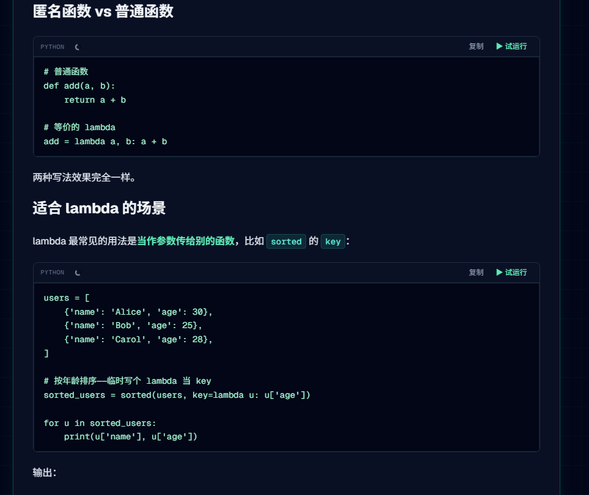

# 函数与匿名函数

图片编号：021, 022, 023

## 主题说明

这一组是函数定义、参数、返回值和匿名函数。

## 必要解释

- 函数的核心作用是把重复逻辑封装起来，后续 FastAPI 接口本质上也是把函数暴露成网络接口。
- `lambda` 匿名函数适合写很短的临时函数，不建议一开始过度使用。

## 图片

### 图 021

### 图 022

### 图 023

