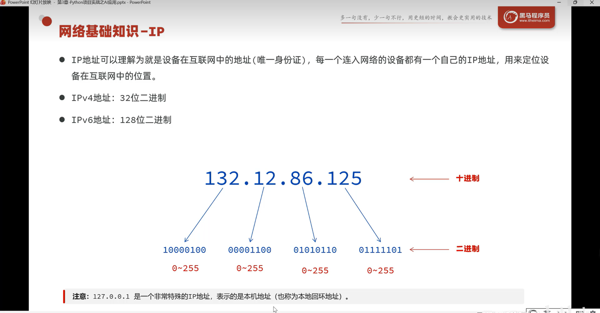
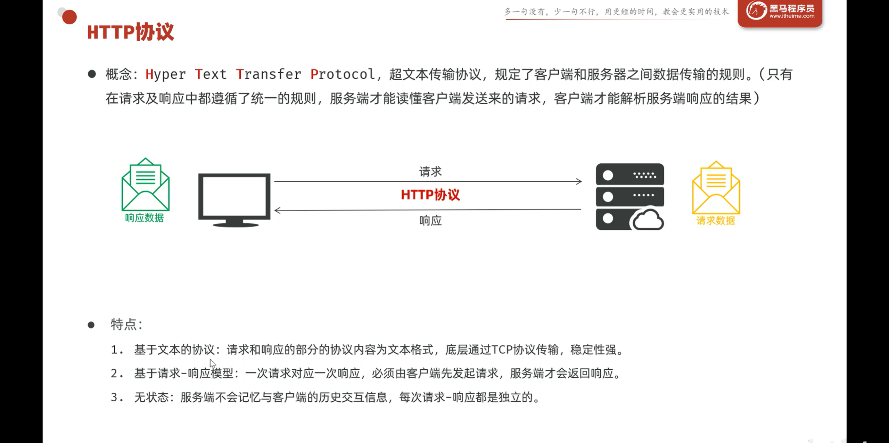
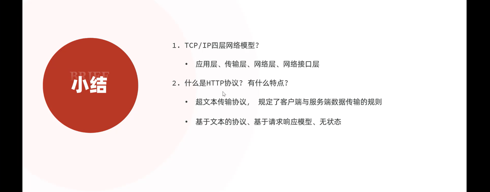
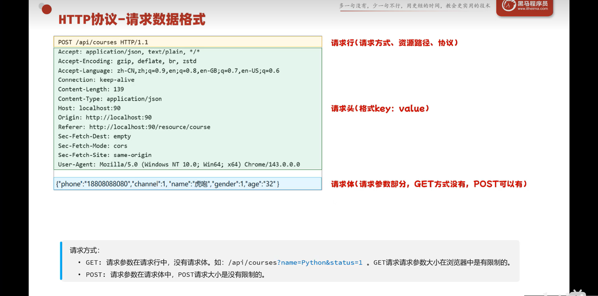
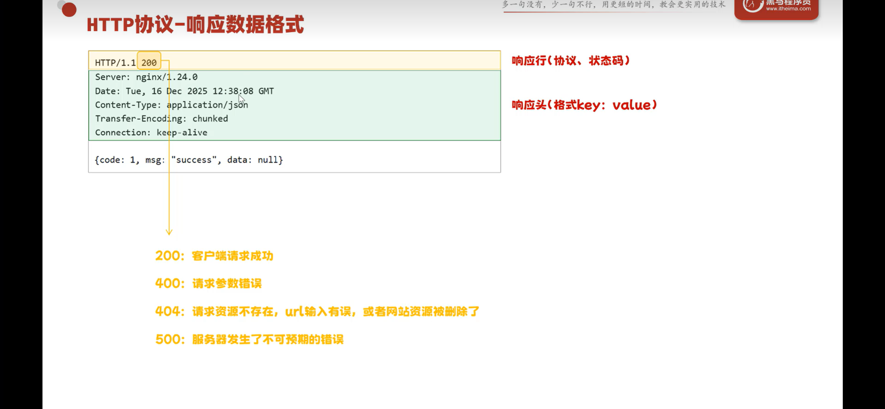
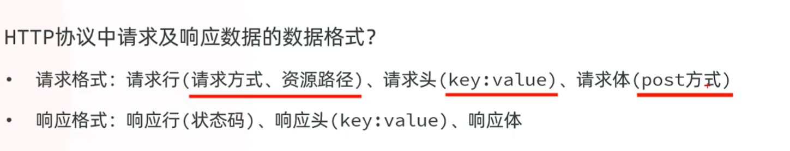

# HTTP与AI接口基础

图片编号：066, 067, 068, 069, 070, 071, 072

## 主题说明

这一组包括 HTTP、TCP/IP、请求/响应数据格式，以及 AI 对话接口里的 role/content 结构。

## 必要解释

- HTTP 可以理解成浏览器、前端、后端之间传递数据的协议。
- 请求一般包含请求方法、路径、请求头、请求体；响应一般包含状态码、响应头、响应体。
- AI 对话接口常见结构是 `role` 和 `content`，例如 system/user/assistant。

## 图片

### 图 066

### 图 067

### 图 068

### 图 069

### 图 070

### 图 071

### 图 072

