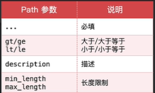
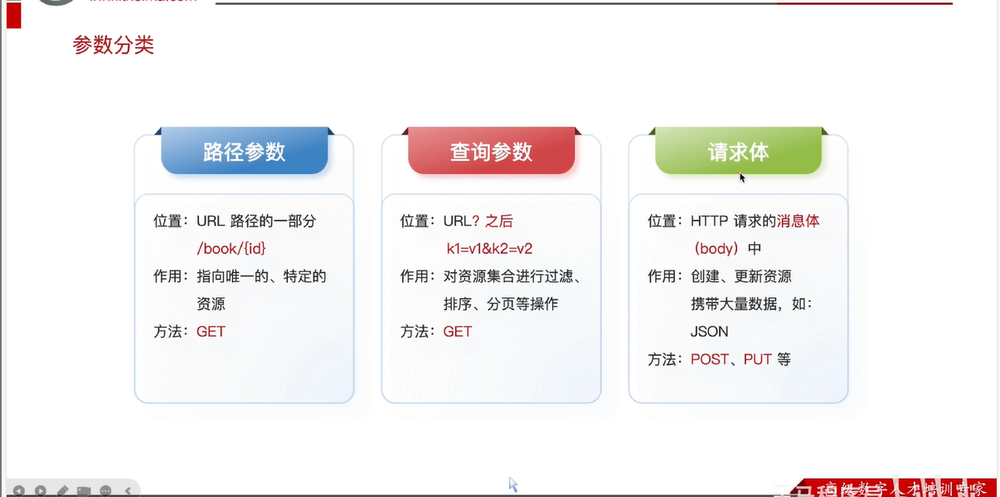
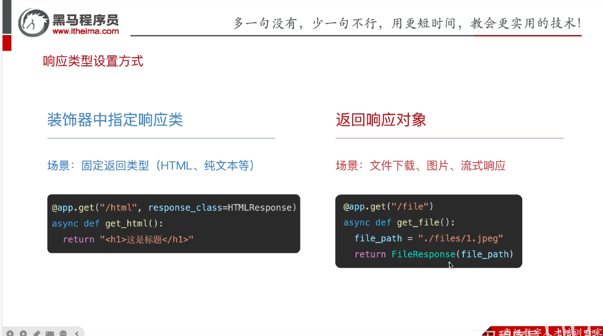
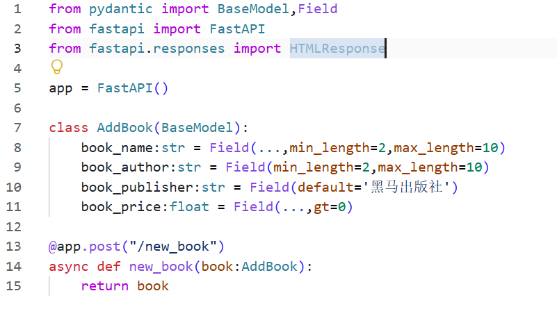
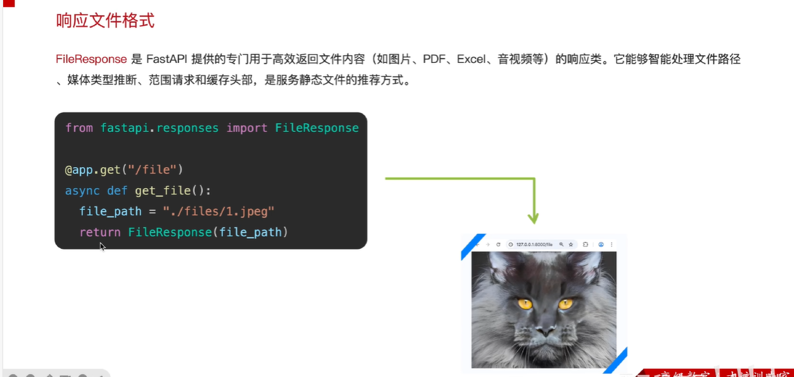
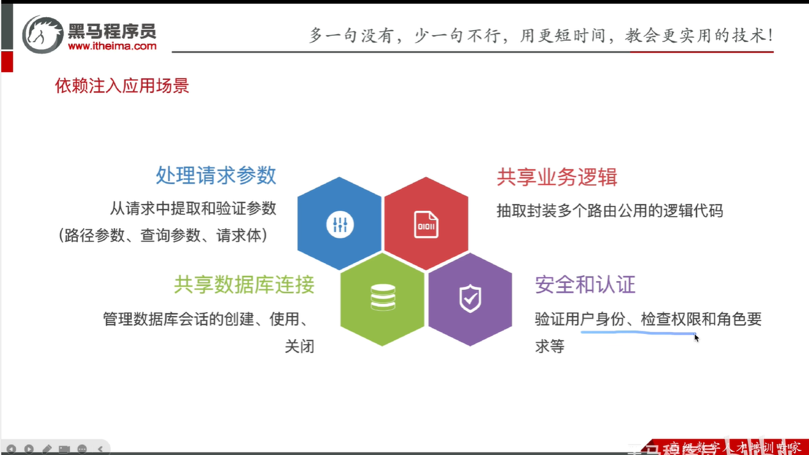
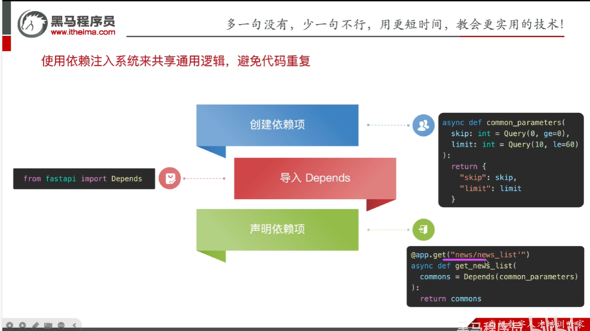
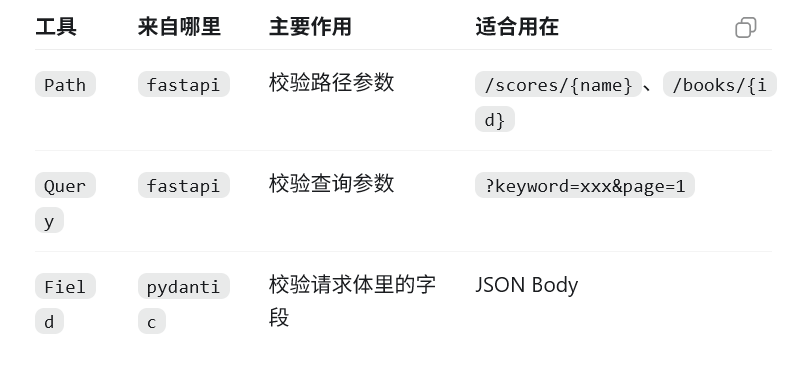

# FastAPI接口开发

图片编号：073, 074, 075, 076, 077, 078, 079, 080

## 主题说明

这一组是 FastAPI 参数分类、Path、Query、Field、FileResponse、Depends 等接口开发基础。

## 必要解释

- `Path` 用于路径参数，例如 `/scores/{name}`。
- `Query` 用于查询参数，例如 `/scores?name=张三`。
- `Field` 用在 Pydantic 模型里，校验请求体 JSON 字段。
- `Depends` 是依赖注入，后面做登录、数据库会经常出现，现在先知道它用于复用公共逻辑。

## 图片

### 图 073

### 图 074

### 图 075

### 图 076

### 图 077

### 图 078

### 图 079

### 图 080

