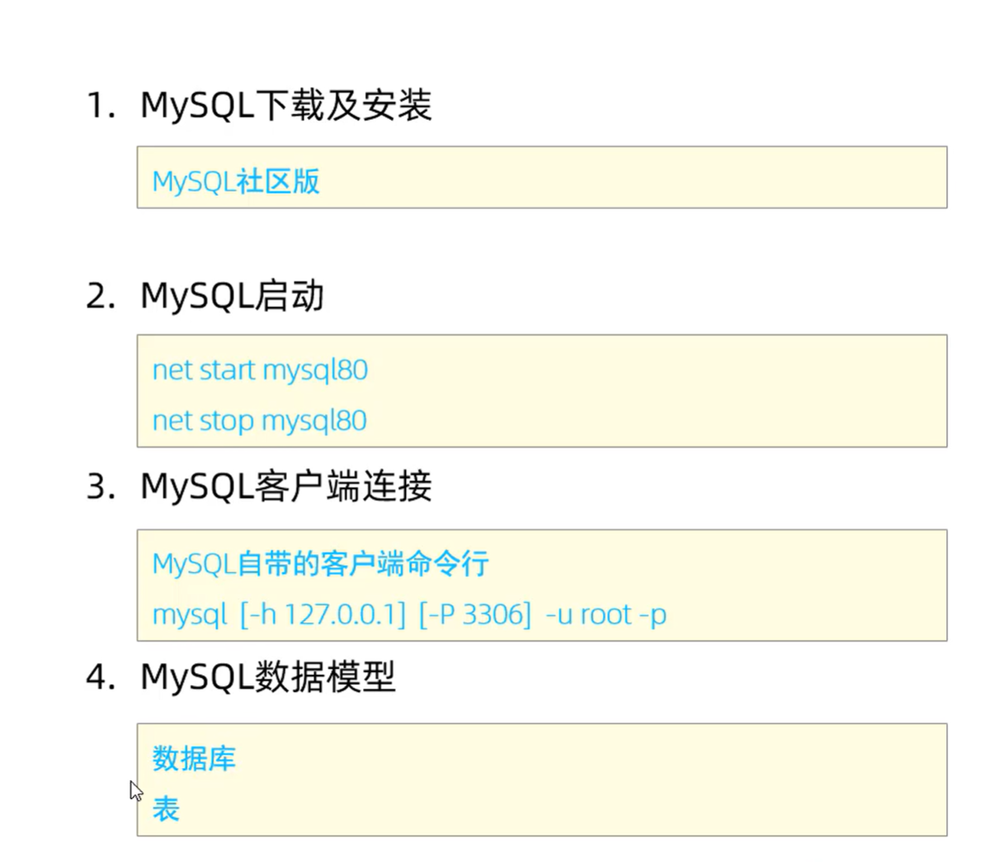
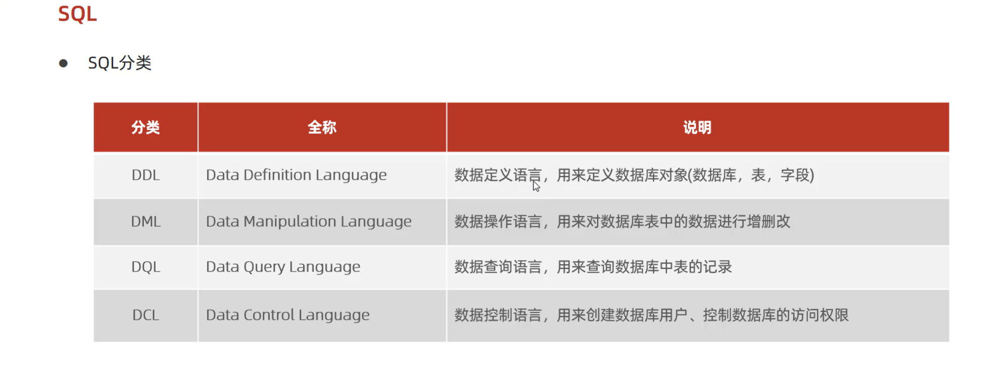
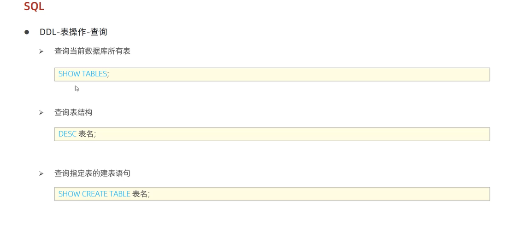

# MySQL安装与SQL分类

图片编号：081, 082, 083

## 主题说明

这一组是 MySQL 安装、启动和 SQL 分类。

## 必要解释

- SQL 常见分类：DDL 管表结构，DML 管数据增删改，DQL 管查询，DCL 管用户和权限。
- 学习 FastAPI 后端时，SQL 是把 JSON 文件升级为数据库存储的关键。

## 图片

### 图 081

### 图 082

### 图 083

