# SQL函数、权限与外键约束

图片编号：108, 109, 110, 111, 112, 113, 114, 115, 116, 117, 118, 119, 120, 124, 125, 126, 127

## 主题说明

这一组包括 MySQL 用户权限、字符串/数值/日期/流程函数，以及外键约束和更新删除行为。

## 必要解释

- SQL 函数是数据库内置的可复用操作，例如字符串处理、日期计算、流程判断。
- DCL 主要控制用户和权限，项目部署时才会更常用。
- 外键用于建立两张表之间的关系，保证数据一致性，但初学阶段先理解概念。

## 图片

### 图 108
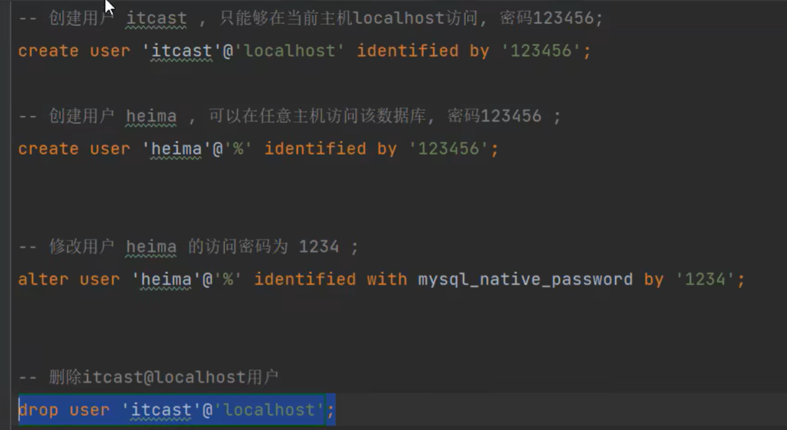

### 图 109
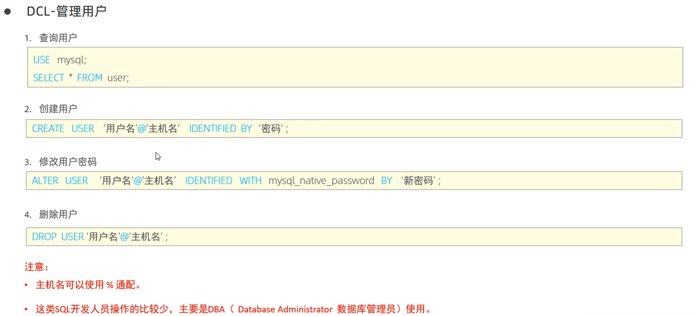

### 图 110
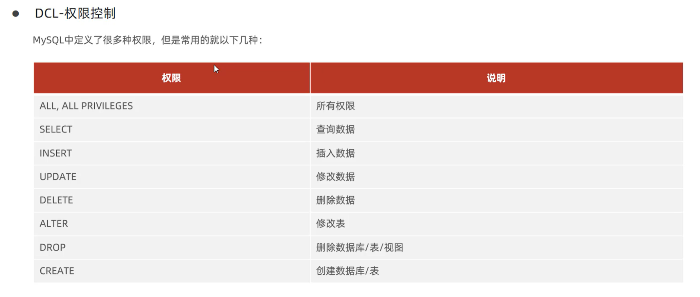

### 图 111
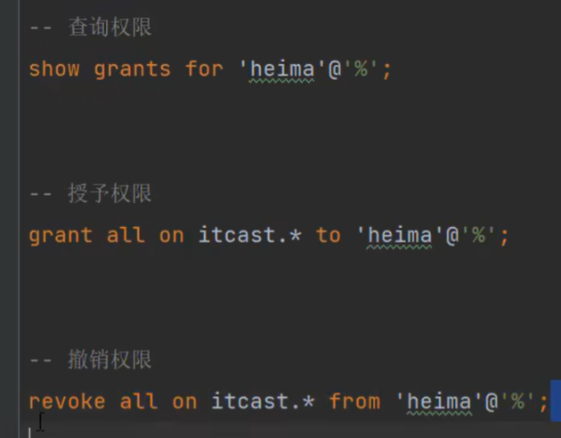

### 图 112
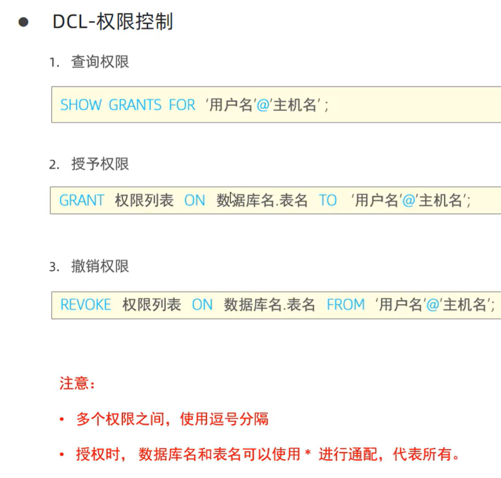

### 图 113

### 图 114
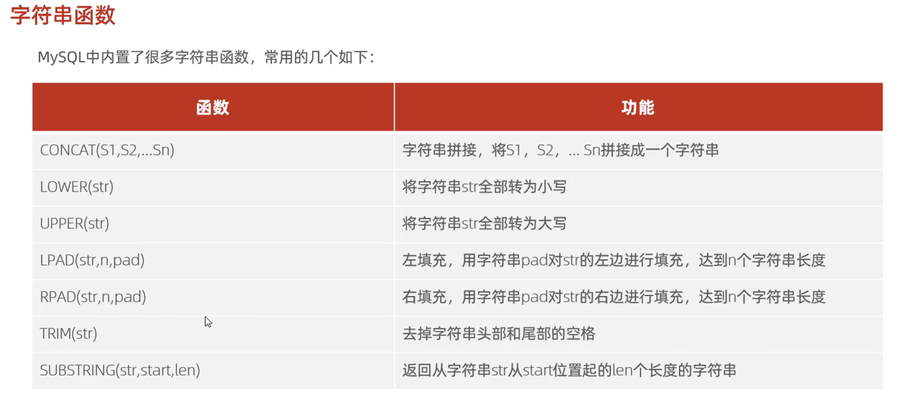

### 图 115
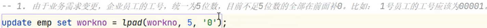

### 图 116
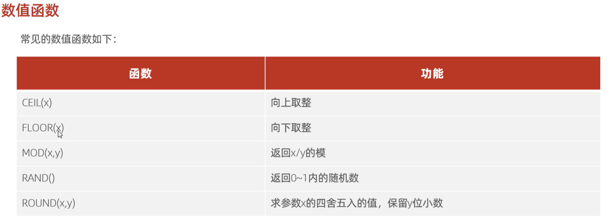

### 图 117
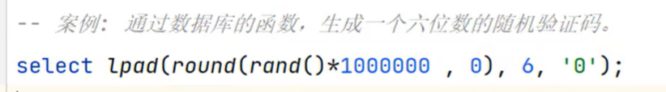

### 图 118
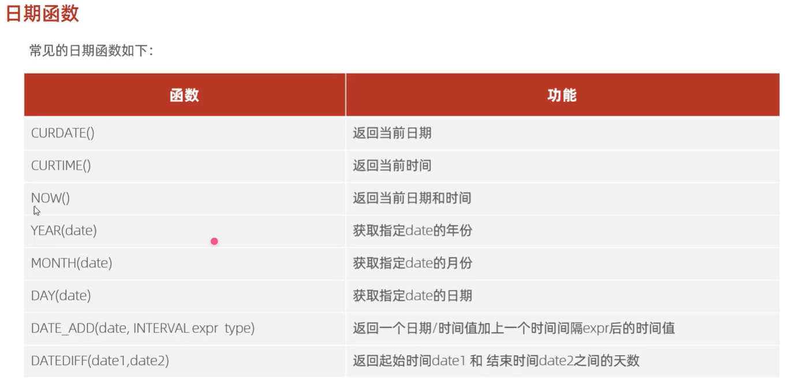

### 图 119
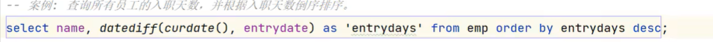

### 图 120
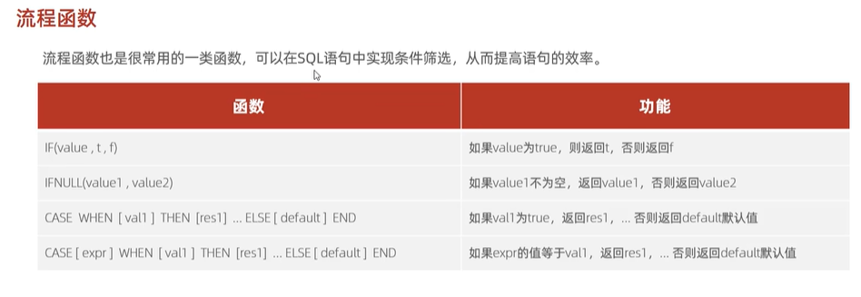

### 图 124
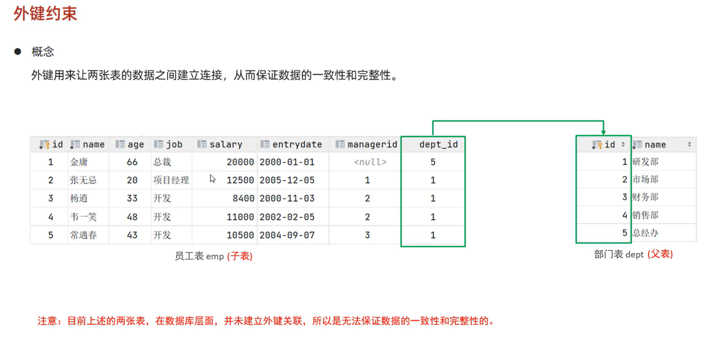

### 图 125
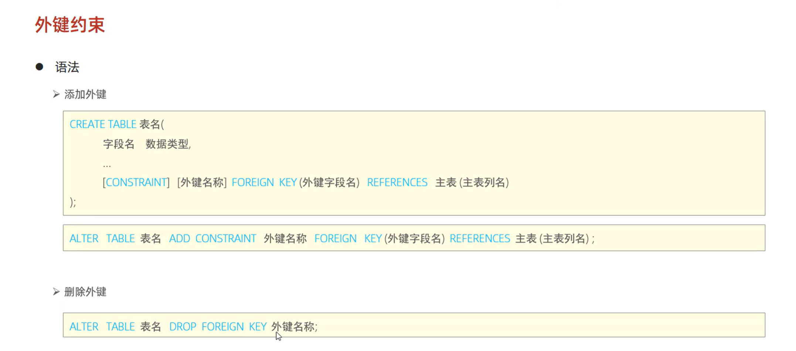

### 图 126
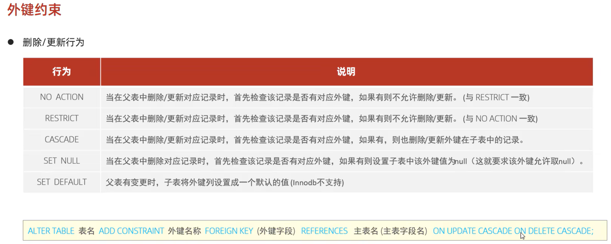

### 图 127
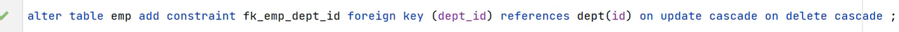
